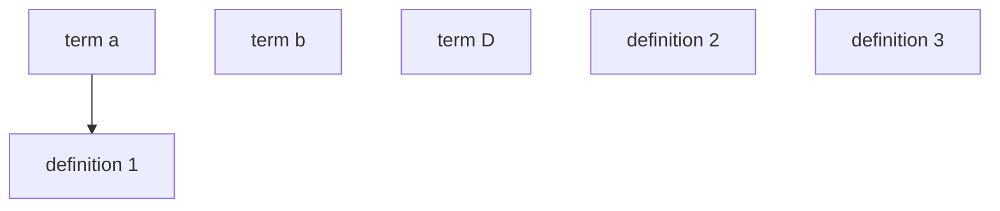

# Page title Heading 

+++
Date

```date
```

+++

An Example question prompt

```open
pre-seeded content for the textarea, can be `markdown` for *style*
```

hint, rendered as small text
+++

A prompt that instructs the user to make connections in a template diagram



> hint, rendered as details 

+++ 

A propmt *with markdown* formatting for a question with no seed

```open
```

`hint in *markdown*, like the prompt, that will show up in the text template`
